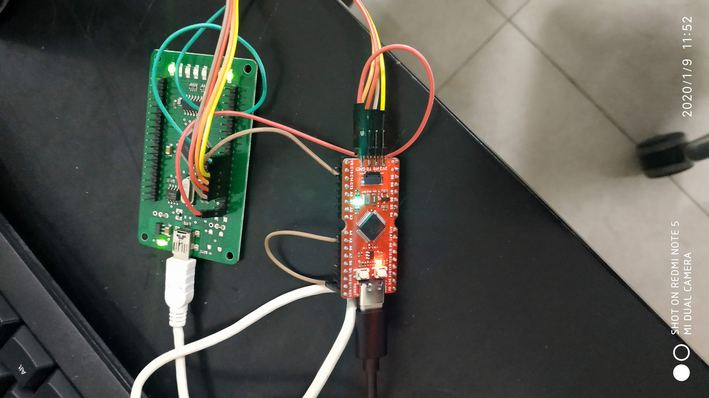

# longan_nano

## Most of all
I ordered this from Aliexpress expecting GD32VF103CBT6 but GD32VF103C8T6 came, which is smaller in flash/sram size.
Just ordered real CBT6.

## Status
1. debug setup  
   FT2232H based JTAG debugging works quite ok.  
   Connection is  

   | FT2232H | GD32VF103 |
   | ------- | --------- |
   | ADBUS0  | TCK       |
   | ADBUS1  | TDI       |
   | ADBUS2  | TDO       |
   | ADBUS3  | TMS       |
   | nSRST   | Reset     |

   In project template directory, invoke openocd like
   ../riscv-openocd/<your OS>/openocd -f ./openocd.cfg

   it seems to be working but needs more experiment.  
   Especially I wonder if we really have to go with SRST connected to Reset.  
   There could be an workaround using system reset of ECLIC.  
   GDB "info threads" with FreeRTOS not working.  
   There is no OpenOCD support for RISC-V yet for this.
2. basic documentation (in progress )  
   ...
3. FreeRTOS template ( in progress )  
   basically demo is working but I had to modify portASM.S.  
   The issue was mcause bit encoding. It surely seems different from  
   standard RISC-V literature.
   And I'm not sure interrupt handling is being done properly.  
   It's just too hard to read the chinese Bumblebee core document.  
4. GD32VF103 variants
   Just edit TARGET_VARIANT in Makefile.  
   For C8T6, set it to c8t6  
   For CBT6, set it to cbt6

5. Makefile cleanup (in progress)  
   Maybe it's much better to move Makefiles to top level template Makefile and  
   include it for specific project through make variables definitions and overrides.
